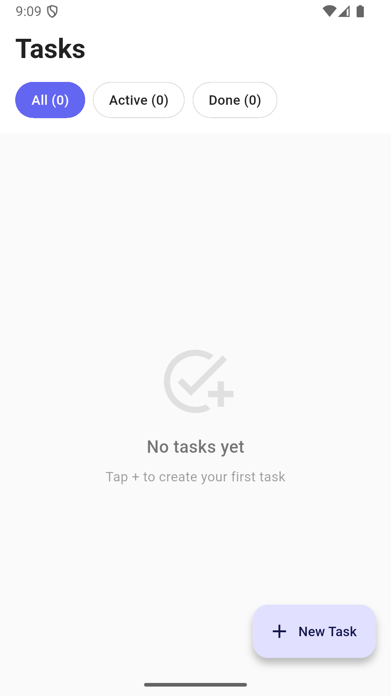
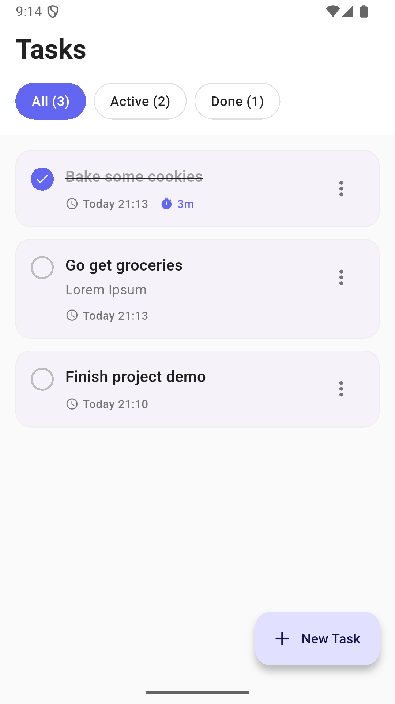
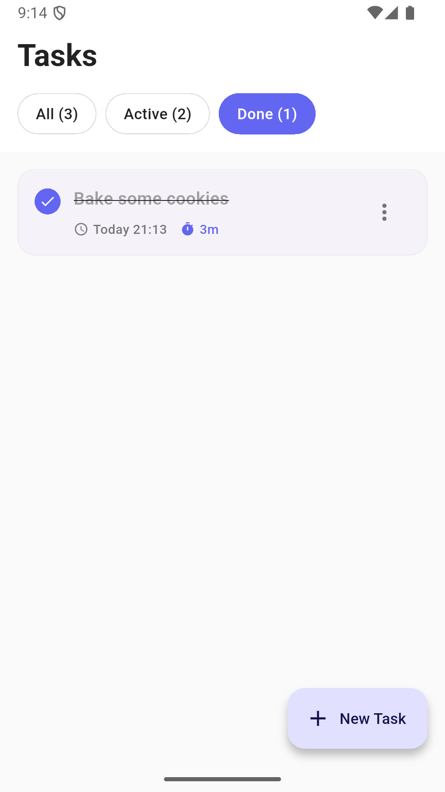
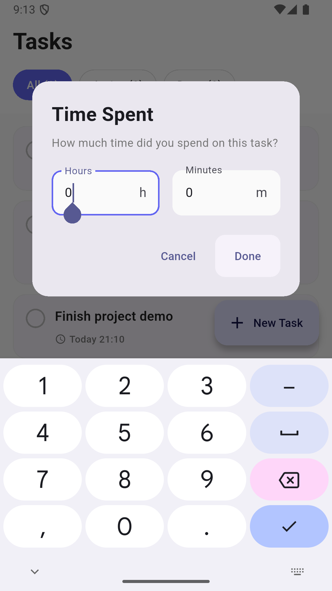
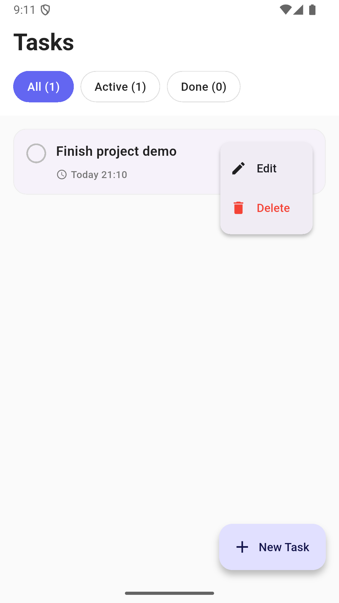

# Task Manager - Flutter App

A simple mobile task management application with time tracking.

## Screenshots

     

## Features

- Create, edit, and delete tasks
- Track time spent when completing tasks
- Material Design 3 UI
- Persistent local storage
- Filter by status (All/Active/Completed)
- Responsive design

## Setup

### Prerequisites
- Flutter SDK 3.0.0+
- Dart SDK

### Installation

1. Clone repository:
```bash
git clone https://github.com/GChukwudi/Task-Manager.git
cd Task-Manager
```

2. Install dependencies:
```bash
flutter pub get
```

3. Run:
```bash
flutter run
```

## Architecture

- **Models**: Task data structure
- **Screens**: Main UI screen
- **Widgets**: Reusable components
- **Utils**: Storage service

## Design Decisions

- **State Management**: StatefulWidget for simplicity (appropriate for small app scope with localized state; avoids overhead of Provider/Bloc/Riverpod while maintaining readability and meeting the app's requirements)
- **Storage**: SharedPreferences for lightweight local saving on device 
  (stores tasks as JSON, loads on app start, auto-saves on modifications)
- **UI**: Material Design 3 with indigo accent

## Testing
```bash
flutter test
```

## Time Spent

- Planning: 30 min
- Development: 3 hours
- Testing: 45 min
- Documentation: 30 min
- **Total: ~5 hours**

## License

Skill's evaluation purposes